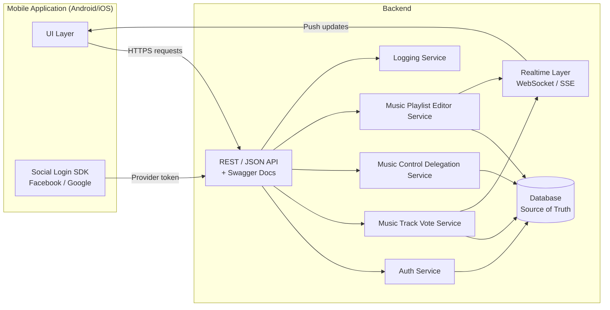
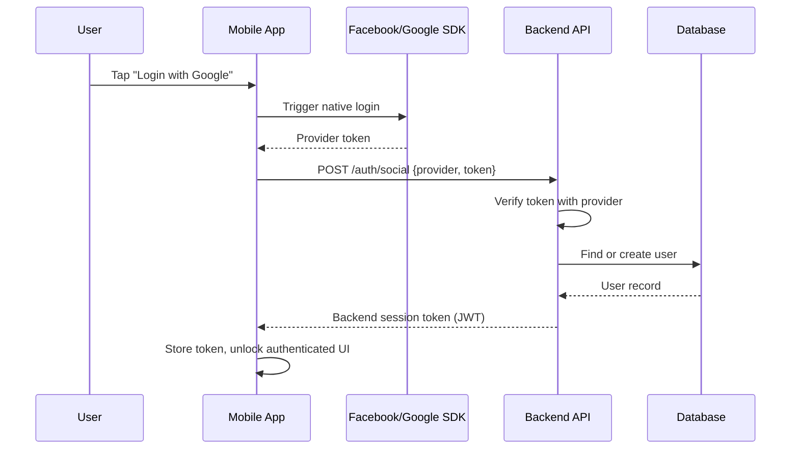
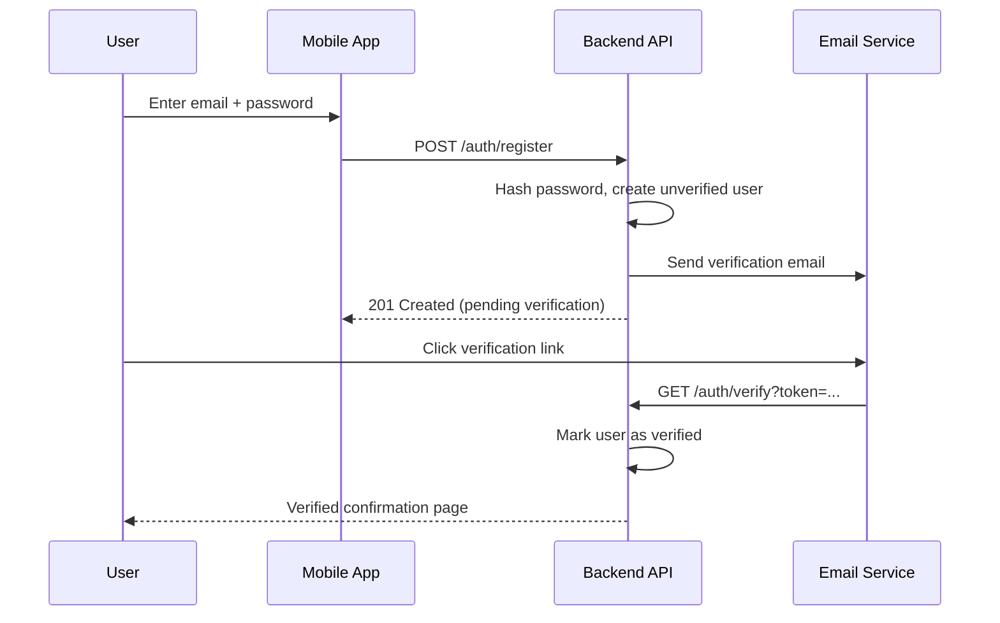
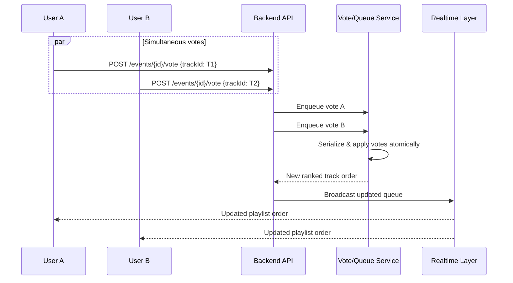
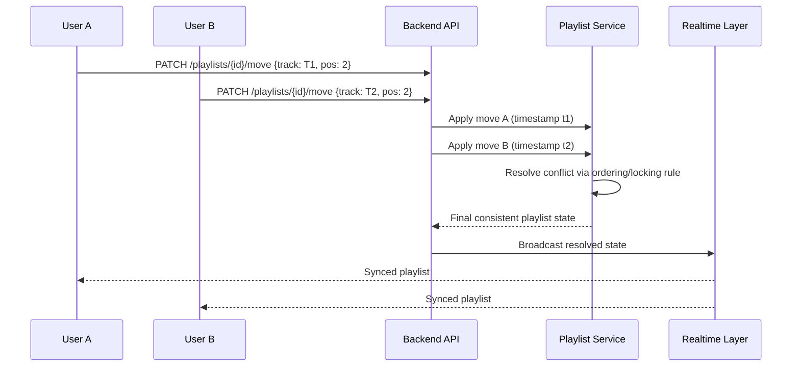
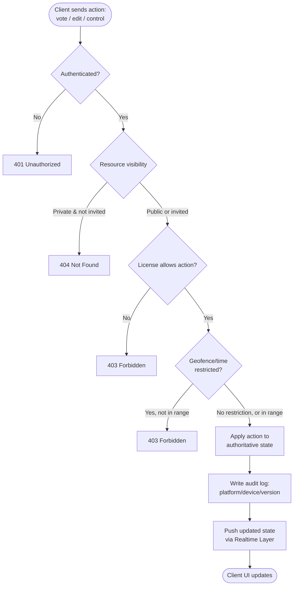
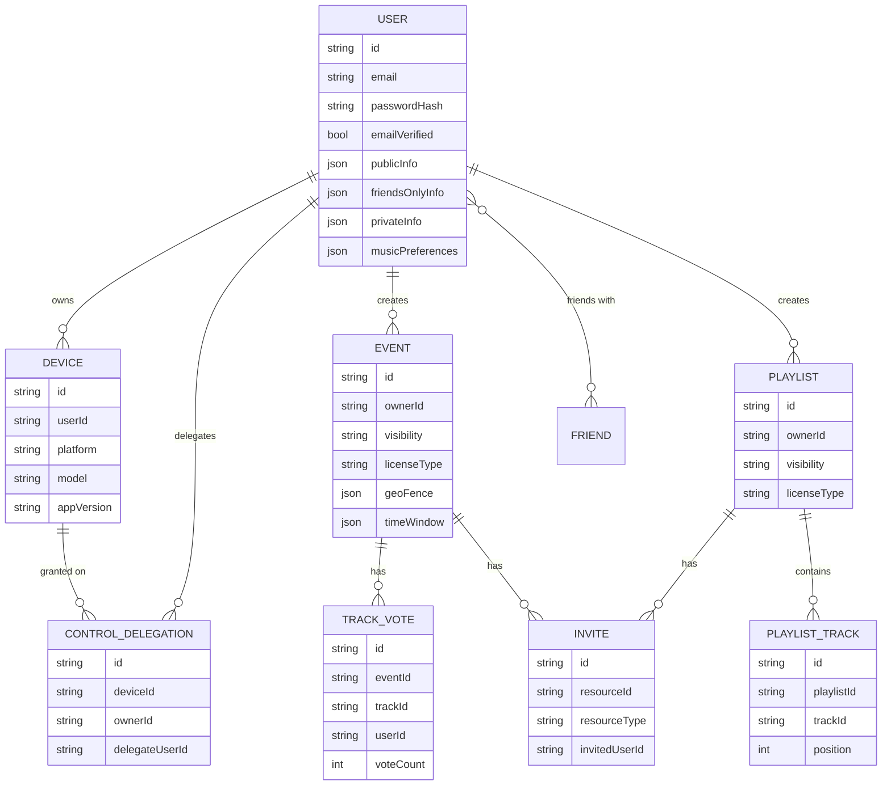

# Music Room — Backend Requirements

**Version:** 1.0
**Scope:** Backend / API / Server-side requirements and integration contract with the mobile frontend
**Source:** Music Room subject, v6

---

## Table of Contents

1. [Overview](#1-overview)
2. [Architecture](#2-architecture)
3. [Data Model — User](#3-data-model--user)
4. [Core Services](#4-core-services)
   - [4.1 Music Track Vote](#41-music-track-vote)
   - [4.2 Music Control Delegation](#42-music-control-delegation)
   - [4.3 Music Playlist Editor](#43-music-playlist-editor)
5. [API Layer](#5-api-layer)
6. [Security](#6-security)
7. [Logging](#7-logging)
8. [Load & Capacity Planning](#8-load--capacity-planning)
9. [Frontend Integration Contract](#9-frontend-integration-contract)
10. [Diagrams](#10-diagrams)

---

## 1. Overview

The backend is the **single source of truth** for the Music Room platform. All mobile clients act purely as "remote controls" — they hold no authoritative state and perform no business logic locally. Every read, write, vote, edit, or delegation action passes through the backend API.

**Non-negotiable principles:**

- Backend = truth. Client = view + input.
- No third-party libraries committed to the repo — dependencies fetched via `Makefile` (or equivalent) on clone.
- No hardcoded secrets — all credentials/API keys/env vars live in a git-ignored `.env`.
- Any external SDK (Facebook, Google) must **not** perform the actual account/business logic — it only produces a token that the backend verifies.

---

## 2. Architecture

- **Technology:** free choice (PHP, Node.js, Go, Firebase, etc.) — must be justified in terms of trade-offs (scalability, real-time support, team familiarity, hosting cost).
- **Style:** REST recommended (justify if deviating).
- **Format:** JSON recommended (justify if deviating).
- **Documentation:** self-generated API reference (e.g., Swagger/OpenAPI) covering all methods, inputs, outputs.
- **Deployment:** backend address must be configurable by clients (dev / staging / prod).

---

## 3. Data Model — User

| Field group       | Description                                              |
| ----------------- | -------------------------------------------------------- |
| Public info       | Visible to any user                                      |
| Friends-only info | Visible only to accepted friends                         |
| Private info      | Visible only to the owner                                |
| Music preferences | Genres/artists/tastes, used for playlist/collab matching |

**Account creation:**

- Email/password **or** social login (Facebook / Google)
- Email/password accounts require:
  - Mandatory email verification before full access
  - Password reset flow ("forgot password")
- A user can **link** a social account to an existing email/password account after registration

---

## 4. Core Services

> The app must expose **at least 2 of the 3** services below. All three are documented for completeness.

### 4.1 Music Track Vote

Live, shared queue for an event (party, festival, etc.). Any participant can suggest or vote for the next track; vote count reorders the playback queue.

**Visibility:**
| Mode | Behavior |
|---|---|
| Public (default) | Any user can discover and vote on the event |
| Private | Only invited users can find and vote |

**License / permission tiers:**
| Tier | Behavior |
|---|---|
| Default | Everyone can vote |
| Restricted | Only invited users can vote |
| Geofenced + time-boxed | Only users physically present in a location, within a time window (e.g. 4–6 PM), can vote |

**Concurrency requirement:** the backend must correctly serialize simultaneous votes (same track or different tracks) so the resulting order is deterministic and consistent for all clients.

### 4.2 Music Control Delegation

Allows a user to hand off playback control (play/pause/skip/next) to friends.

- License/permission is **per-device** (tied to the specific device registered to the user's account, not just the account globally)
- Owner can grant/revoke control to specific friends at any time

### 4.3 Music Playlist Editor

Real-time, multi-user collaborative playlist editing (e.g. building a shared "radio station").

**Visibility:**
| Mode | Behavior |
|---|---|
| Public (default) | Any user can view/access the playlist |
| Private | Only invited users can access it |

**License / permission tiers:**
| Tier | Behavior |
|---|---|
| Default | Everyone can edit |
| Restricted | Only invited users can edit |

**Concurrency requirement:** the backend must resolve simultaneous edits (two users moving the same track, or different tracks, at once) into one consistent, conflict-free playlist state, pushed to all connected clients.

---

## 5. API Layer

- Acts as the **only** access point to the backend for all clients (mobile, future web, third-party integrators).
- Must be documented as a first-class deliverable (methods, inputs, outputs) — treat it as a public contract, since other developers may build against it.
- REST + JSON recommended; alternatives permitted if justified (e.g. GraphQL, gRPC).
- Versioning strategy should be defined (e.g. `/api/v1/...`) to avoid breaking existing clients as the API evolves.

---

## 6. Security

- Authenticated users may access **only their own data** — enforced server-side on every request, never assumed from client-side state.
- Threat model must address (not necessarily fully mitigate, but identify + explain protections for):
  - API brute-force attempts (rate limiting, lockouts, CAPTCHA)
  - Session/token theft (short-lived tokens, refresh tokens, revocation)
  - Injection / malformed input
- Visibility and license rules (public/private, vote/edit permissions) are enforced **only** by the backend — the client renders what the API allows, it never self-restricts.
- Secrets management: `.env` file, git-ignored, never committed.

---

## 7. Logging

Every mobile-triggered action must generate a corresponding backend log entry, capturing:

- Platform (Android, iOS, etc.)
- Device (model — e.g. iPhone 6G, Samsung Edge, etc.)
- Application version

This metadata should be sent by the client (e.g. as request headers) so the backend can log it consistently.

---

## 8. Load & Capacity Planning

- Backend/API load must be benchmarked with a real tool: Apache Benchmark, Gatling, Siege, Tsung, JMeter, etc.
- Deliverables:
  - Documented server specs (CPU, RAM, cloud vs. on-prem)
  - Measured/justified maximum concurrent users **per service** (Vote, Delegation, Playlist Editor)
  - Capacity claim must be consistent with the hosting tier chosen (e.g. dozens of users on a Raspberry Pi, thousands on a low-end server)

---

## 9. Frontend Integration Contract

This section defines exactly how the mobile app and backend must interact.

### 9.1 Principle: thin client

The mobile app contains **no authoritative state**. It calls the API for every read and write, and renders whatever the API returns. It does not locally decide permissions, visibility, or vote/edit outcomes — it only reflects the backend's decisions.

### 9.2 Configurable backend address

The app must expose a setting (build config, settings screen, or env-based build flavor) to point at different backend URLs, so QA can target local/staging/prod without a rebuild.

### 9.3 Authentication handoff

| Flow                           | Client responsibility                                | Backend responsibility                                                        |
| ------------------------------ | ---------------------------------------------------- | ----------------------------------------------------------------------------- |
| Email/password                 | Collect credentials, submit to API                   | Validate, issue session/JWT token, send verification email, handle reset flow |
| Social login (Facebook/Google) | Use official SDK **only** to obtain a provider token | Verify token server-side, create/link account, issue backend session token    |
| Account linking                | Trigger SDK auth flow from profile screen            | Verify token, attach provider identity to existing account                    |

The SDK's job stops at "get me a token" — all account creation/linking/session logic is backend-owned, per the "the SDK must not do your work" constraint.

### 9.4 Real-time updates

Vote counts and playlist edits must propagate to all connected clients close to instantly. Recommended: WebSockets / Socket.io / Server-Sent Events, with the backend as the single arbiter of conflict resolution — it computes final state and pushes it down; the client never resolves conflicts itself.

### 9.5 Request metadata for logging

Every API call from the mobile app should include platform, device, and app version (e.g. custom headers) so the backend can log actions per section 7.

### 9.6 Error & permission responses

The API must return clear, consistent error codes/messages for:

- Authentication failure (401)
- Authorization/permission failure (403) — e.g. trying to vote/edit without the right license
- Not found / private resource (404)
- Rate limiting (429)

The client uses these to drive UI state (e.g. "you don't have permission to edit this playlist") without embedding the permission logic itself.

---

## 10. Diagrams

### 10.1 High-Level Architecture

### 10.2 Authentication Sequence (Social Login)

### 10.3 Email/Password Registration & Verification

### 10.4 Music Track Vote — Concurrent Voting Flow

### 10.5 Playlist Editing — Conflict Resolution

### 10.6 Permission / Visibility Decision Flow

### 10.7 Data Model Overview

---

_End of document._
